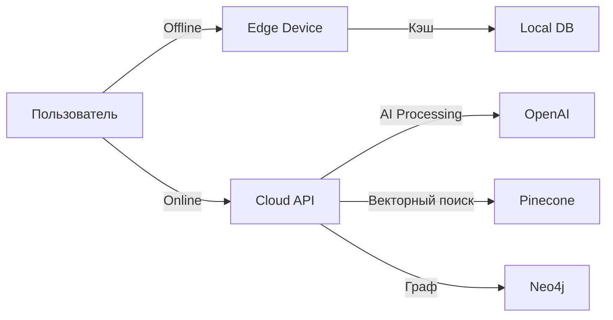

# SynapseMind — Улучшенная Концепция

## 1. Название и Айдентика

**SynapseMind** (СинапсМайнд) — интеллектуальная система управления знаниями с AI-наставником.

### Визуальная идентичность
- **Логотип**: Нейронное соединение с точкой фокуса (символизирует связь знаний)
- **Цветовая палитра**:
  - Primary: `#6366F1` (Indigo — интеллект, технологии)
  - Secondary: `#10B981` (Emerald — рост, развитие)
  - Accent: `#F59E0B` (Amber — энергия, активность)
  - Background: `#0F172A` (Slate 900 — глубина)
  - Surface: `#1E293B` (Slate 800)
  - Text: `#F8FAFC` (Slate 50)

### Девиз
> "From Information to Understanding"

---

## 2. Персонализация: Уникальные Фичи

### 2.1 Context Engine (Контекстный Движок)

В отличие от конкурентов, SynapseMind понимает **контекст пользователя**:

```typescript
interface UserContext {
  profession: string;           // Роль: Developer, Designer, PM, Researcher
  currentProjects: Project[];   // Текущие проекты
  careerGoals: Goal[];          // Карьерные цели
  knowledgeGaps: Gap[];         // Выявленные пробелы
  learningStyle: Style;        // Визуальный, аудиальный, кинестетический
  availableTime: TimeRange;    // Сколько времени в день на обучение
}
```

**Как работает**:
- При импорте контента AI анализирует его релевантность к текущим проектам
- Автоматически предлагает применить знания из статьи к активному проекту
- Рекомендует повторить концепции, которые забываются, перед важной встречей

### 2.2 Neural Recall™ (Нейронное Вспоминание)

Инновационная система интервального повторения:

- **Адаптивная сложность**: Вопросы усложняются пропорционально уверенности пользователя
- **Контекстуальные связи**: Вопросы связывают материалы из разных источников
- **Мультиформат**: Текст, аудио (Synapse может озвучить вопрос), визуальные схемы
- **Нейробиологический подход**: Алгоритм учитывает кривую забывания Эббингауза

### 2.3 Knowledge Synthesis (Синтез Знаний)

AI не просто хранит — **создает новое знание**:

```python
# Пример: автоматическое создание выводов
class KnowledgeSynthesizer:
    def synthesize(self, documents: list[Document]) -> Synthesis:
        # Находит противоречия между источниками
        # Выявляет общие паттерны
        # Генерирует новые инсайты
        # Создает "мосты" между несвязанными концепциями
```

### 2.4 Personal AI Mentor "Synapse" (Синапс)

Персонализированный AI-репетитор с характером:

| Характеристика | Описание |
|----------------|----------|
| Имя | Synapse (Синапс) |
| Голос | Настраиваемый (формальный/дружеский/мотивирующий) |
| Стиль обучения | Адаптируется под пользователя |
| Память | Помнит историю обучения, ошибки, успехи |

**Возможности Synapse**:
1. **Socratic Dialogue**: Метод Сократа — задает наводящие вопросы
2. **Real-time Context**: Понимает, над чем работает пользователь сейчас
3. **Emotional Intelligence**: Замечает фрустрацию, предлагает перерыв
4. **ProgressCelebration**: Отмечает достижения, даже маленькие

---

## 3. Улучшенные Функции

### 3.1 Universal Import Hub

| Источник | Метод | Особенности |
|----------|-------|-------------|
| Веб-статьи | Browser Extension | Читает статью, удаляет шум, сохраняет суть |
| YouTube | API интеграция | Транскрипция, таймкоды ключевых моментов |
| Подкасты | RSS + Whisper | Извлечение ключевых цитат |
| PDF/Ebooks | OCR + AI | Структурирование, извлечение таблиц/кодов |
| Twitter/X | API | Сохранение тредов с AI-анализом |
| Notion | OAuth | Импорт с сохранением связей |
| Obsidian | Vault sync | Локальная синхронизация |
| Kindle | Highlights API | Импорт с книгами |

### 3.2 Knowledge Graph 2.0

**Визуализация**:
- 3D-режим для погружения в связи
- Фильтры по проектам, времени, тегам
- Heatmap "неизученных" областей
- Timeline: как знания развивались

**Алгоритмы**:
- Centrality Analysis: какие концепции самые важные
- Gap Detection: что не хватает для полной картины
- Serendipity Engine: рекомендует неочевидные связи

### 3.3 Active Workspace

Рабочее пространство, а не хранилище:

```typescript
interface Workspace {
  activeProject: Project;
  recentConcepts: Concept[];     // Что изучал недавно
  pendingReviews: Review[];     // Что нужно повторить
  aiSuggestions: Suggestion[]; // AI-рекомендации
  collaborators: User[];       # Кто работает с тобой
}
```

### 3.4 Collaboration: Knowledge Circles

Приватные пространства для команд:

- **Team Graph**: Общий граф знаний команды
- **Expertise Maps**: Карты экспертизы каждого участника
- **Discussion Threads**: Обсуждения привязаны к концепциям
- **Knowledge Gaps**: AI выявляет, каких знаний не хватает команде

---

## 4. Персонализированный UI/UX

### 4.1 Адаптивные Интерфейсы

```typescript
type InterfaceMode = 
  | 'focus'      // Минимум отвлечений, только контент
  | 'learning'  // Synapse активен, предлагает помощь
  | 'research'  // Много панелей, поиск, фильтры
  | 'review'    // Только карточки, статистика
  | 'collaborate'; // Видимость команды
```

### 4.2 Onboarding Journey

**День 1-7**: Foundation
1. Интеграция 3 источников (Readwise, Notion, Pocket...)
2. Профиль: цели, проекты, стиль обучения
3. Первый импорт — AI строит начальный граф

**День 8-30**: Discovery
1. Первый "aha moment" — увидеть связи
2. Первая сессия с Synapse
3. Первый review

**День 30+**: Mastery
1. Deep customization
2. Team collaboration
3. Knowledge sharing

---

## 5. Монетизация 2.0

### Тарифы с Персонализацией

| План | Цена | Особенности |
|------|------|-------------|
| **Starter** | $0/мес | 25 документов, базовый AI, 1 источник |
| **Pro** | $14.99/мес | Безлимит, полный AI, все источники, Graph |
| **Team** | $29/user | Общий граф,Synapse для команды, админ |
| **Enterprise** | Индивид. | Custom AI, SSO, API, on-premise |

### Дополнительные Потоки

1. **SynapseMentor Premium**: Персональный AI-коуч с видео-сессиями
2. **Knowledge Marketplace**: Покупка готовых Graph Maps от экспертов
3. **Certification Path**: Проверенные программы обучения с сертификацией
4. **API Access**: Для разработчиков (free tier + paid)

---

## 6. Технологическая Инновация

### Edge AI + Cloud Hybrid



**Преимущества**:
- Работает без интернета
- Минимальная задержка
- Приватность данных

---

## 7. Roadmap

### Фаза 1: MVP (3 месяца)
- [x] Импорт из 3 источников
- [ ] Базовая Graph визуализация
- [ ] Simple AI assistant
- [ ] Web + Mobile

### Фаза 2: Growth (6 месяцев)
- [ ] Все источники
- [ ] Advanced Graph
- [ ] Synapse AI
- [ ] Team features

### Фаза 3: Scale (12 месяцев)
- [ ] Enterprise
- [ ] Marketplace
- [ ] API
- [ ] White-label

---

## 8. Конкурентные Преимущества

| Параметр | Notion | Obsidian | Readwise | **SynapseMind** |
|----------|--------|----------|----------|-----------------|
| AI-репетитор | ❌ | ❌ | ❌ | ✅ |
| Knowledge Graph | ❌ | Частично | ❌ | ✅ Полный |
| Контекст проектов | ❌ | ❌ | ❌ | ✅ |
| Spaced Repetition | ❌ | Плагины | ✅ | ✅ AI-Enhanced |
| Авто-синтез | ❌ | ❌ | ❌ | ✅ |

---

## 9. Метрики Успеха

### Product Metrics
- DAU/MAU > 30%
- Time in app > 15 мин/сессия
- Knowledge Graph nodes created > 50/неделя
- Review completion rate > 70%

### Business Metrics
- CAC < $50
- LTV > $200
- Churn < 5%/мес
- NPS > 50

---

*SynapseMind — не просто инструмент, а партнер в вашем интеллектуальном развитии.*
