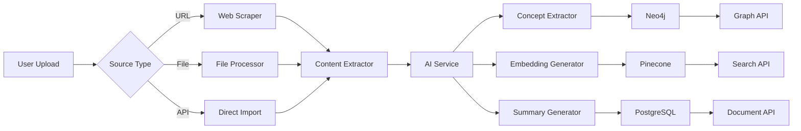
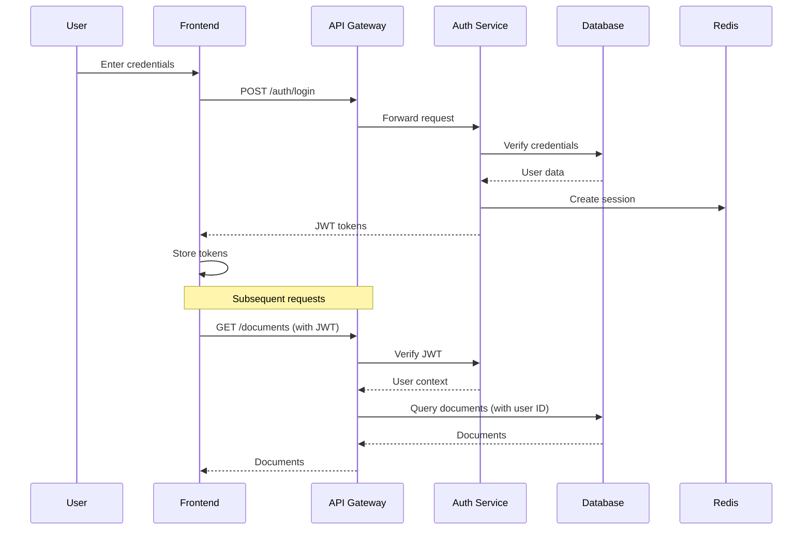

# SynapseMind — Architecture Documentation

## Table of Contents

1. [System Overview](#1-system-overview)
2. [High-Level Architecture](#2-high-level-architecture)
3. [Service Architecture](#3-service-architecture)
4. [Data Architecture](#4-data-architecture)
5. [AI/ML Pipeline](#5-aiml-pipeline)
6. [Infrastructure](#6-infrastructure)
7. [Security Architecture](#7-security-architecture)
8. [Scalability](#8-scalability)
9. [Disaster Recovery](#9-disaster-recovery)

---

## 1. System Overview

SynapseMind is a complex, distributed system designed to:

1. **Ingest** content from multiple sources (web, PDF, video, podcasts, etc.)
2. **Process** content using AI to extract concepts and relationships
3. **Store** data in relational and graph databases
4. **Serve** intelligent features: knowledge graph visualization, AI tutoring, spaced repetition
5. **Scale** to support millions of users

### Design Principles

| Principle | Description |
|-----------|-------------|
| **Microservices** | Loose coupling, independent deployment |
| **Event-Driven** | Async processing for AI tasks |
| **Edge + Cloud** | Offline-first mobile experience |
| **Zero Trust** | Every request authenticated |
| **Observability** | Full traceability |

---

## 2. High-Level Architecture

```
┌─────────────────────────────────────────────────────────────────────────────┐
│                                 CLIENTS                                       │
│  ┌─────────────────┐  ┌─────────────────┐  ┌─────────────────┐            │
│  │     Web App     │  │   Mobile App    │  │   Extension     │            │
│  │   (React)       │  │  (React Native) │  │   (Chrome)     │            │
│  └────────┬────────┘  └────────┬────────┘  └────────┬────────┘            │
└───────────┼────────────────────┼────────────────────┼──────────────────────┘
            │                    │                    │
            └────────────────────┴────────────────────┘
                                 │
                                 ▼
┌─────────────────────────────────────────────────────────────────────────────┐
│                              CDN (CloudFront)                                │
│  Static assets, Graph visualizations, Media files                          │
└─────────────────────────────────────────────────────────────────────────────┘
                                 │
                                 ▼
┌─────────────────────────────────────────────────────────────────────────────┐
│                            API GATEWAY (Kong)                               │
│  ┌─────────────┐  ┌─────────────┐  ┌─────────────┐  ┌─────────────┐        │
│  │   Rate      │  │    Auth     │  │   Load      │  │   Cache     │        │
│  │   Limit     │  │   Verify    │  │   Balance   │  │   Layer     │        │
│  └─────────────┘  └─────────────┘  └─────────────┘  └─────────────┘        │
└─────────────────────────────────────────────────────────────────────────────┘
                                 │
                                 ▼
┌─────────────────────────────────────────────────────────────────────────────┐
│                          MESSAGE QUEUE (Kafka)                               │
│  ┌──────────┐  ┌──────────┐  ┌──────────┐  ┌──────────┐                   │
│  │ document │  │  review  │  │   sync   │  │  analytics│                   │
│  │  events  │  │  events  │  │  events  │  │  events  │                   │
│  └──────────┘  └──────────┘  └──────────┘  └──────────┘                   │
└─────────────────────────────────────────────────────────────────────────────┘
                                 │
         ┌────────────────────────┴────────────────────────┐
         │                                                 │
         ▼                                                 ▼
┌─────────────────────────────────┐    ┌─────────────────────────────────────┐
│      CORE SERVICES              │    │       AI SERVICES                   │
│  ┌────────────────────────────┐ │    │  ┌─────────────────────────────┐   │
│  │  Auth Service (3001)       │ │    │  │  AI Processing Service (3004)│   │
│  │  - JWT/OAuth               │ │    │  │  - OpenAI/Claude integration  │   │
│  │  - Session management      │ │    │  │  - Concept extraction        │   │
│  └────────────────────────────┘ │    │  │  - Summary generation        │   │
│  ┌────────────────────────────┐ │    │  │  - Card generation           │   │
│  │  Document Service (3002)   │ │    │  └─────────────────────────────┘   │
│  │  - Import processing       │ │    │  ┌─────────────────────────────┐   │
│  │  - Content extraction      │ │    │  │  Embedding Service (3009)   │   │
│  │  - Metadata extraction     │ │    │  │  - Vector generation        │   │
│  └────────────────────────────┘ │    │  │  - Semantic search          │   │
│  ┌────────────────────────────┐ │    │  └─────────────────────────────┘   │
│  │  User Service (3005)       │ │    └─────────────────────────────────────┘
│  │  - Profile management      │ │
│  │  - Preferences              │ │
│  └────────────────────────────┘ │    ┌─────────────────────────────────────┐
│  ┌────────────────────────────┐ │    │       DATA LAYER                    │
│  │  Learning Service (3006)    │ │    │  ┌───────────┐ ┌────────┐            │
│  │  - Spaced repetition       │ │    │  │PostgreSQL │ │ Neo4j  │            │
│  │  - Review scheduling        │ │    │  │  (Main)   │ │(Graph) │            │
│  │  - Progress tracking        │ │    │  └───────────┘ └────────┘            │
│  └────────────────────────────┘ │    │  ┌───────────┐ ┌────────┐            │
│  ┌────────────────────────────┐ │    │  │ Pinecone  │ │ Redis  │            │
│  │  Team Service (3010)       │ │    │  │ (Vector)  │ │(Cache) │            │
│  │  - Team management         │ │    │  └───────────┘ └────────┘            │
│  │  - Permissions              │ │    │  ┌───────────┐                      │
│  └────────────────────────────┘ │    │  │    S3     │                      │
└─────────────────────────────────┘    │  │ (Storage) │                      │
                                       └─────────────────────────────────────┘
```

---

## 3. Service Architecture

### 3.1 Service Mesh

```
┌─────────────────────────────────────────────────────────────────────────────┐
│                              SERVICE MESH                                    │
│                                                                               │
│    ┌─────────┐                                                              │
│    │  Kong   │  API Gateway                                                  │
│    │ Gateway │                                                              │
│    └────┬────┘                                                              │
│         │                                                                   │
│    ┌────┴────┐      ┌──────────────────────────────────────────────────┐   │
│    │ Service │      │              Kubernetes Cluster                   │   │
│    │  Mesh   │      │                                                       │   │
│    └────┬────┘      │  ┌─────────┐    ┌─────────┐    ┌─────────┐        │   │
│         │           │  │  Auth   │    │   AI    │    │  Graph  │        │   │
│         │           │  │ Pod (x3)│    │ Pod (x3)│    │ Pod (x3)│        │   │
│         │           │  └─────────┘    └─────────┘    └─────────┘        │   │
│         │           │       │              │              │              │   │
│         │           │       └──────────────┼──────────────┘              │   │
│         │           │                      ▼                             │   │
│         │           │              ┌─────────────┐                        │   │
│         │           │              │   Istio    │                        │   │
│         │           │              │   Sidecar  │                        │   │
│         │           │              └─────────────┘                        │   │
│         │           └──────────────────────────────────────────────────────┘   │
│         │                                                                       │
│    ┌────┴────┐                                                                 │
│    │  Redis  │  Session & Rate Limiting                                        │
│    │  Cache  │                                                                 │
│    └─────────┘                                                                 │
└─────────────────────────────────────────────────────────────────────────────┘
```

### 3.2 Service Responsibilities Matrix

| Service | Port | Language | Dependencies | SLO |
|---------|------|----------|-------------|-----|
| auth-service | 3001 | Node.js | PostgreSQL, Redis | 99.9% |
| import-service | 3002 | Node.js | S3, Kafka | 99.5% |
| graph-service | 3003 | Node.js | Neo4j, PostgreSQL | 99.9% |
| ai-service | 3004 | Python | OpenAI, Pinecone, Kafka | 99.0% |
| user-service | 3005 | Node.js | PostgreSQL | 99.9% |
| learning-service | 3006 | Node.js | PostgreSQL, Redis | 99.9% |
| sync-service | 3007 | Node.js | PostgreSQL, Redis | 99.5% |
| team-service | 3010 | Node.js | PostgreSQL | 99.9% |
| embedding-service | 3009 | Python | Pinecone, OpenAI | 99.0% |

### 3.3 Inter-Service Communication

```typescript
// Synchronous: gRPC
// File: proto/user_service.proto
syntax = "proto3";

package synapse.user;

service UserService {
  rpc GetUser(GetUserRequest) returns (User);
  rpc UpdateUser(UpdateUserRequest) returns (User);
  rpc GetUserPreferences(GetUserPreferencesRequest) returns (Preferences);
}

// Asynchronous: Kafka Events
// File: events/domain-events.ts
interface DomainEvent {
  eventId: string;
  eventType: string;
  timestamp: string;
  userId: string;
  payload: Record<string, unknown>;
}

interface DocumentImportedEvent extends DomainEvent {
  eventType: 'document.imported';
  payload: {
    documentId: string;
    source: string;
    wordCount: number;
  };
}

interface ConceptExtractedEvent extends DomainEvent {
  eventType: 'concept.extracted';
  payload: {
    conceptId: string;
    documentId: string;
    importance: number;
  };
}
```

---

## 4. Data Architecture

### 4.1 Database Topology

```
┌─────────────────────────────────────────────────────────────────────────────┐
│                            DATABASE LAYER                                    │
│                                                                              │
│  ┌──────────────────────────────────────────────────────────────────────┐    │
│  │                        POSTGRESQL CLUSTER                             │    │
│  │                                                                       │    │
│  │    ┌─────────┐         ┌─────────┐         ┌─────────┐              │    │
│  │    │Primary  │────────▶│ Replica │────────▶│ Replica │              │    │
│  │    │   RW    │         │    R    │         │    R    │              │    │
│  │    └─────────┘         └─────────┘         └─────────┘              │    │
│  │        │                                                           │    │
│  │        │  Streaming Replication                                    │    │
│  │        ▼                                                           │    │
│  │    ┌─────────┐                                                    │    │
│  │    │  PgPool │  Connection Pooling                                │    │
│  │    └─────────┘                                                    │    │
│  │                                                                       │    │
│  │  Tables: users, documents, review_cards, teams, subscriptions      │    │
│  └──────────────────────────────────────────────────────────────────────┘    │
│                                                                              │
│  ┌──────────────────────────────────────────────────────────────────────┐    │
│  │                           NEO4J CLUSTER                              │    │
│  │                                                                       │    │
│  │    ┌─────────┐         ┌─────────┐                                  │    │
│  │    │  Core   │────────▶│ Read    │────────▶│ Causal Cluster        │    │
│  │    │ Primary │         │ Replica │         │                       │    │
│  │    └─────────┘         └─────────┘                                  │    │
│  │                                                                       │    │
│  │  Nodes: Concept, Document, User                                     │    │
│  │  Relationships: CONTAINS, RELATES_TO, LEARNED_FROM                  │    │
│  └──────────────────────────────────────────────────────────────────────┘    │
│                                                                              │
│  ┌─────────────┐    ┌─────────────┐    ┌─────────────┐                     │
│  │  PINECONE   │    │    REDIS     │    │      S3     │                     │
│  │  (Vectors)  │    │   (Cache)    │    │   (Files)   │                     │
│  │             │    │              │    │             │                     │
│  │  - Embeddings│    │  - Sessions  │    │  - PDFs     │                     │
│  │  - Semantic │    │  - Graph cache│   │  - Videos   │                     │
│  │    Search   │    │  - Rate limits│   │  - Images   │                     │
│  └─────────────┘    └─────────────┘    └─────────────┘                     │
│                                                                              │
└─────────────────────────────────────────────────────────────────────────────┘
```

### 4.2 Data Flow



### 4.3 Caching Strategy

| Cache Layer | Technology | TTL | Invalidation |
|-------------|------------|-----|--------------|
| API Response | Redis | 5-60 min | Event-based |
| Graph Data | Redis | 1-5 min | On update |
| User Session | Redis | 24h | Manual |
| Static Assets | CDN | 24h | Versioning |
| Database Query | PgPool | Query-level | Auto |

---

## 5. AI/ML Pipeline

### 5.1 Document Processing Pipeline

```
┌─────────────────────────────────────────────────────────────────────────────┐
│                        DOCUMENT PROCESSING PIPELINE                          │
│                                                                              │
│  ┌─────────┐    ┌─────────┐    ┌─────────┐    ┌─────────┐                  │
│  │  Input  │───▶│ Extract │───▶│ Chunk   │───▶│ Embed   │                  │
│  │         │    │ Content │    │         │    │         │                  │
│  └─────────┘    └─────────┘    └─────────┘    └────┬────┘                  │
│                                                      │                       │
│                                                      ▼                       │
│  ┌─────────────────────────────────────────────────────────────────────┐    │
│  │                        AI PROCESSING                                │    │
│  │                                                                       │    │
│  │   ┌─────────────────┐    ┌─────────────────┐                       │    │
│  │   │  Concept        │    │  Summary         │                       │    │
│  │   │  Extraction     │    │  Generation      │                       │    │
│  │   │  (GPT-4)       │    │  (GPT-4)         │                       │    │
│  │   └─────────────────┘    └─────────────────┘                       │    │
│  │                                                                       │    │
│  │   ┌─────────────────┐    ┌─────────────────┐                       │    │
│  │   │  Review Cards   │    │  Relationship   │                       │    │
│  │   │  Generation     │    │  Detection      │                       │    │
│  │   └─────────────────┘    └─────────────────┘                       │    │
│  │                                                                       │    │
│  └─────────────────────────────────────────────────────────────────────┘    │
│                              │                                               │
│       ┌──────────────────────┼──────────────────────┐                       │
│       ▼                      ▼                      ▼                       │
│  ┌──────────┐          ┌──────────┐          ┌──────────┐                 │
│  │ Neo4j    │          │Pinecone  │          │PostgreSQL│                 │
│  │(Concepts)│          │(Vectors) │          │(Summary) │                 │
│  └──────────┘          └──────────┘          └──────────┘                 │
│                                                                              │
└─────────────────────────────────────────────────────────────────────────────┘
```

### 5.2 AI Service Architecture

```python
# ai_service/architecture.py
from dataclasses import dataclass
from typing import AsyncIterator
import asyncio

@dataclass
class ProcessingResult:
    concepts: list[Concept]
    summary: str
    relationships: list[Relationship]
    review_cards: list[ReviewCard]
    embeddings: list[float]

class AIProcessingPipeline:
    """Async pipeline for document processing"""
    
    def __init__(
        self,
        llm: BaseLLM,
        embedding_model: EmbeddingModel,
        vector_store: VectorStore
    ):
        self.llm = llm
        self.embedding_model = embedding_model
        self.vector_store = vector_store
        
    async def process_document(
        self, 
        document: Document
    ) -> ProcessingResult:
        """Process document through full pipeline"""
        
        # Step 1: Extract text content
        content = await self._extract_content(document)
        
        # Step 2: Generate summary (parallel with chunking)
        summary_task = self._generate_summary(content)
        chunks_task = self._chunk_content(content)
        
        summary, chunks = await asyncio.gather(
            summary_task, 
            chunks_task
        )
        
        # Step 3: Extract concepts (parallel with embedding)
        concepts_task = self._extract_concepts(chunks)
        embeddings_task = self._generate_embeddings(chunks)
        
        concepts, embeddings = await asyncio.gather(
            concepts_task,
            embeddings_task
        )
        
        # Step 4: Detect relationships
        relationships = await self._detect_relationships(concepts)
        
        # Step 5: Generate review cards
        review_cards = await self._generate_review_cards(concepts)
        
        # Step 6: Store in databases (parallel)
        await asyncio.gather(
            self._store_concepts(concepts),
            self._store_embeddings(embeddings),
            self._store_summary(summary)
        )
        
        return ProcessingResult(
            concepts=concepts,
            summary=summary,
            relationships=relationships,
            review_cards=review_cards,
            embeddings=embeddings
        )
```

---

## 6. Infrastructure

### 6.1 Cloud Architecture (AWS)

```
┌─────────────────────────────────────────────────────────────────────────────┐
│                        AWS INFRASTRUCTURE                                   │
│                                                                              │
│  ┌─────────────────────────────────────────────────────────────────────┐    │
│  │                        VPC (10.0.0.0/16)                             │    │
│  │                                                                       │    │
│  │   ┌─────────────────────────────────────────────────────────────┐   │    │
│  │   │                    PUBLIC SUBNET                             │   │    │
│  │   │                                                              │   │    │
│  │   │   ┌─────────────┐  ┌─────────────┐  ┌─────────────┐         │   │    │
│  │   │   │    ALB      │  │    ALB      │  │   CloudFront│         │   │    │
│  │   │   │  (API)      │  │  (Admin)    │  │  (CDN)      │         │   │    │
│  │   │   └─────────────┘  └─────────────┘  └─────────────┘         │   │    │
│  │   │         │                │                                  │   │    │
│  │   └─────────┼────────────────┼──────────────────────────────────┘   │    │
│  │             │                │                                     │    │
│  │   ┌─────────┴────────────────┴──────────────────────────────────┐   │    │
│  │   │                    PRIVATE SUBNET 1                         │   │    │
│  │   │                                                              │   │    │
│  │   │   ┌──────────┐  ┌──────────┐  ┌──────────┐                │   │    │
│  │   │   │   ECS    │  │   ECS    │  │   ECS    │   ┌──────────┐ │   │    │
│  │   │   │ Service  │  │ Service  │  │ Service  │   │   RDS    │ │   │    │
│  │   │   │  (API)   │  │   (AI)   │  │ (Worker) │   │PostgreSQL│ │   │    │
│  │   │   └──────────┘  └──────────┘  └──────────┘   └──────────┘ │   │    │
│  │   │                                            ┌──────────┐   │   │    │
│  │   │                                            │  Elasti  │   │   │    │
│  │   │                                            │ Cache    │   │   │    │
│  │   │                                            │ (Redis)  │   │   │    │
│  │   │                                            └──────────┘   │   │    │
│  │   └────────────────────────────────────────────────────────────┘   │    │
│  │                                                                       │    │
│  │   ┌─────────────────────────────────────────────────────────────┐   │    │
│  │   │                    PRIVATE SUBNET 2                         │   │    │
│  │   │                                                              │   │    │
│  │   │   ┌──────────┐  ┌──────────┐  ┌──────────┐                │   │    │
│  │   │   │   ECS    │  │   MSK    │  │          │                │   │    │
│  │   │   │ Service  │  │ (Kafka)  │  │   NAT    │                │   │    │
│  │   │   │ (Graph)  │  │          │  │ Gateway  │                │   │    │
│  │   │   └──────────┘  └──────────┘  └──────────┘                │   │    │
│  │   │                                            ┌──────────┐   │   │    │
│  │   │                                            │  Neo4j   │   │   │    │
│  │   │                                            │  Cluster │   │   │    │
│  │   │                                            └──────────┘   │   │    │
│  │   └────────────────────────────────────────────────────────────┘   │    │
│  │                                                                       │    │
│  └─────────────────────────────────────────────────────────────────────┘    │
│                                    │                                         │
│  ┌─────────────────────────────────┴────────────────────────────────────┐   │
│  │                         OUTSIDE VPC                                  │   │
│  │   ┌──────────┐  ┌──────────┐  ┌──────────┐  ┌──────────┐          │   │
│  │   │  Route53 │  │    S3    │  │  Secret  │  │  Secret  │          │   │
│  │   │   (DNS)  │  │(Documents)│  │ Manager  │  │ Manager  │          │   │
│  │   └──────────┘  └──────────┘  └──────────┘  └──────────┘          │   │
│  └─────────────────────────────────────────────────────────────────────┘   │
└─────────────────────────────────────────────────────────────────────────────┘
```

### 6.2 Kubernetes Deployment

```yaml
# k8s/production-values.yaml
replicas: 3

autoscaling:
  enabled: true
  minReplicas: 3
  maxReplicas: 20
  targetCPUUtilization: 70
  targetMemoryUtilization: 80

resources:
  limits:
    cpu: "2000m"
    memory: "4Gi"
  requests:
    cpu: "500m"
    memory: "1Gi"

livenessProbe:
  httpGet:
    path: /health
    port: 4000
  initialDelaySeconds: 30
  periodSeconds: 10
  failureThreshold: 3

readinessProbe:
  httpGet:
    path: /ready
    port: 4000
  initialDelaySeconds: 5
  periodSeconds: 5
  failureThreshold: 3

# Environment variables
env:
  - name: NODE_ENV
    value: "production"
  - name: LOG_LEVEL
    value: "info"
  - name: DATABASE_POOL_SIZE
    value: "20"
```

---

## 7. Security Architecture

### 7.1 Security Layers

```
┌─────────────────────────────────────────────────────────────────────────────┐
│                         SECURITY LAYERS                                      │
│                                                                              │
│  ┌─────────────────────────────────────────────────────────────────────┐    │
│  │                         EDGE SECURITY                               │    │
│  │   ┌───────────┐  ┌───────────┐  ┌───────────┐  ┌───────────┐        │    │
│  │   │   WAF     │  │   DDoS    │  │  Rate     │  │   CDN     │        │    │
│  │   │  (AWS WAF)│  │ Protection│  │ Limiting  │  │           │        │    │
│  │   └───────────┘  └───────────┘  └───────────┘  └───────────┘        │    │
│  └─────────────────────────────────────────────────────────────────────┘    │
│                                    │                                         │
│  ┌─────────────────────────────────┴────────────────────────────────────┐    │
│  │                       IDENTITY & ACCESS                            │    │
│  │   ┌───────────┐  ┌───────────┐  ┌───────────┐  ┌───────────┐        │    │
│  │   │    OAuth  │  │    JWT    │  │    MFA    │  │    SSO    │        │    │
│  │   │           │  │  Tokens   │  │           │  │ (SAML/OIDC│        │    │
│  │   └───────────┘  └───────────┘  └───────────┘  └───────────┘        │    │
│  └────────────────────────────────────────────────────────────────────┘    │
│                                    │                                         │
│  ┌─────────────────────────────────┴────────────────────────────────────┐    │
│  │                         DATA SECURITY                               │    │
│  │   ┌───────────┐  ┌───────────┐  ┌───────────┐  ┌───────────┐        │    │
│  │   │Encryption │  │Encryption │  │   Field   │  │   Token   │        │    │
│  │   │   at Rest │  │ in Transit│  │ Encryption│  │  Vault    │        │    │
│  │   │  (AES-256)│  │  (TLS 1.3)│  │           │  │           │        │    │
│  │   └───────────┘  └───────────┘  └───────────┘  └───────────┘        │    │
│  └────────────────────────────────────────────────────────────────────┘    │
│                                    │                                         │
│  ┌─────────────────────────────────┴────────────────────────────────────┐    │
│  │                       APPLICATION SECURITY                          │    │
│  │   ┌───────────┐  ┌───────────┐  ┌───────────┐  ┌───────────┐        │    │
│  │   │   Input   │  │   Query   │  │   Output  │  │  Audit    │        │    │
│  │   │Validation │  │  Sanitize │  │ Sanitize  │  │  Logging  │        │    │
│  │   └───────────┘  └───────────┘  └───────────┘  └───────────┘        │    │
│  └────────────────────────────────────────────────────────────────────┘    │
│                                                                              │
└─────────────────────────────────────────────────────────────────────────────┘
```

### 7.2 Authentication Flow



---

## 8. Scalability

### 8.1 Scaling Strategy

| Component | Scaling Strategy | Trigger |
|-----------|-----------------|---------|
| API Gateway | Horizontal (K8s HPA) | CPU > 70% |
| Auth Service | Horizontal (K8s HPA) | CPU > 70% |
| AI Service | Queue-based | Kafka lag > 1000 |
| Database | Read replicas | CPU > 60% |
| Neo4j | Causal cluster | Query latency > 100ms |
| Pinecone | Auto-scale | Request queue > 100 |
| S3 | N/A (managed) | - |

### 8.2 Performance Targets

| Metric | Target | Critical |
|--------|--------|----------|
| API Latency (p50) | 100ms | 200ms |
| API Latency (p99) | 500ms | 1s |
| Graph Query (p50) | 50ms | 100ms |
| AI Processing | 30s | 120s |
| Page Load | 2s | 5s |
| Uptime | 99.9% | 99.5% |

---

## 9. Disaster Recovery

### 9.1 Backup Strategy

| Data Store | Backup Frequency | Retention | Recovery Target |
|------------|-----------------|-----------|-----------------|
| PostgreSQL | Hourly + daily | 30 days | 1 hour RPO |
| Neo4j | Daily | 30 days | 4 hours RPO |
| S3 | Continuous | 90 days | 1 hour RPO |
| Redis | N/A (ephemeral) | - | - |

### 9.2 Recovery Procedures

```bash
#!/bin/bash
# scripts/disaster-recovery.sh

# Database recovery
restore_postgres() {
    LATEST_BACKUP=$(aws s3 ls s3://synapse-backups/postgres/ | tail -1)
    aws s3 cp "s3://synapse-backups/postgres/$LATEST_BACKUP" /tmp/
    pg_restore -h $DB_HOST -U postgres -d synapse /tmp/$LATEST_BACKUP
}

# Neo4j recovery
restore_neo4j() {
    LATEST_BACKUP=$(aws s3 ls s3://synapse-backups/neo4j/ | tail -1)
    aws s3 cp "s3://synapse-backups/neo4j/$LATEST_BACKUP" /tmp/
    neo4j-admin restore --from=/tmp/$LATEST_BACKUP
}

# Update DNS
update_dns() {
    aws route53 change-resource-record-sets \
        --hosted-zone-id $HOSTED_ZONE_ID \
        --change-batch file://dns-failover.json
}
```

---

## Appendix: Monitoring Stack

| Tool | Purpose |
|------|---------|
| Datadog | APM, Infrastructure monitoring |
| Sentry | Error tracking |
| PagerDuty | Incident management |
| Grafana | Dashboards |
| Kafka Monitor | Message queue monitoring |

---

*Document Version: 1.0.0*
*Last Updated: 2026-03-01*
